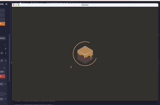
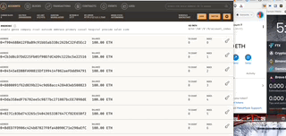

# Crowdsale-ICO


ICO Crowdsales are a novel way for buisnesses to raise capital. This is a demonstration of a blockchain based Crowdsale that accepts Ether in exchange for a token called Kasei Coin. The smart contracts distributes the kaseicoin to the buyers wallet. I have deployed the Solidity Smart Contracts to Remix where I have connected Ganache and Metamask to simulate a complete blockchain development suite. This token Launch inherits some basic characteristics of blockchain including being trustless, permissionless and immutable. This ICO Demo utilizez ERC-20 Standards for Initial Coin Offerings including:

- balanceOf

- ammountRaised

- buyTokens

- claimRefund

- timedCrowdsale

- cappedCrowdsale


## Technologies & Installation

This demonstration was deployed to a local blockchain called Ganache. To install Ganache please see this link:  [Ganache](https://trufflesuite.com/ganache/) and select the installer for your OS. I have also used MetaMask as a Provider for the Ganache private blockchain. Please see this link [MetaMask](https://metamask.io/download/) and select your OS. This will install the MetaMask browser extension. 

What is Ganache?

Ganache is a personal blockchain for rapid Ethereum and Corda distributed application development. You can use Ganache across the entire development cycle; enabling you to develop, deploy, and test your dApps in a safe and deterministic environment. Ganache comes in two flavors: a UI and CLI.

What is MetaMask?

MetaMask is a software cryptocurrency wallet used to interact with the Ethereum blockchain. It allows users to access their Ethereum wallet through a browser extension or mobile app, which can then be used to interact with decentralized applications.

## Usage

This smart contract is written in Solidity and I used the Remix IDE to compile and test functionalities. If the user wants to interact with the smart contract it is possible to clone this repository into a local folder and launch the remix IDE here: [Remix](https://remix.ethereum.org/#optimize=false&runs=200&evmVersion=null&version=soljson-v0.8.7+commit.e28d00a7.js) and select Solidity as the Environment. Next you will want to connect Ganache and Metamask with Remix. 

### Setting up MetaMask

So far you have downloaded the Metamask browser extension from the installations Guide in this README.md. You should be able to select the Metamask icon in the top right corner of your browser window and sign in to your Metamask wallet. Next you will want to connect Metamask with Ganache, to do so, first open Ganache and select the Quickstart option. You should see something like this: 
 and you will want to copy the ``` RPC SERVER ```. Then navigate back to your Metamask wallet and top center of the Metamask window select the Networks tab. Select ``` Add Network ```, and copy the Network Name, New RPC URL and Chain ID.




Now that you have set up Metamask to connect to your private blockchain on Ganache you are almost ready. Navigate back to Ganache and while in the Accounts section, you will see 10 distinct valid Ethereum Address's. These represent 10 distinct Accounts that will help to test the Smart Contract Functions. Click on the Key icon and copy & paste the private key for the first Ganache account.  The last thing to do is head back to Remix and Compile the 2 files:
``` KaseiCoinCrowdsale.sol ```
``` KaseiCoin.sol ``` 
After the files have been compiled, select the Deploy and Run Icon in the Icon Panel on the left side of Remix window. Navigate to the Environments tab and scroll down to ``` Injected Web3 ``` . The Metamask browser extension window will open on the top right corner of your browser window. Select the connect to Remix tab.  Now you have sucessfully Deployed smart contracts to a local blockchain with Remix, Metamask and Ganache. The KaseiCoinCrowdsale contract inherits ERC-20 Standards from the OpenZepplin library including:

- Crowdsale

- Minted Crowdsale

- Capped Crowdsale

- Timed Crowdsale

- Refundable Post Delivery Crowdsale

It is important to Compile the 2 files ``` KaseiCoinCrowdsale.sol ``` & ``` KaseiCoin.sol ``` Then you want to Deploy them. The way to deploy is 

## Contributors

stephenthomas43@gmail.com

[Trilogy Education Services](https://www.trilogyed.com/)

[UC Berkeley Extension ](https://extension.berkeley.edu/)


## License 

MIT


# Preview of Smart Contract Funtionality
---


