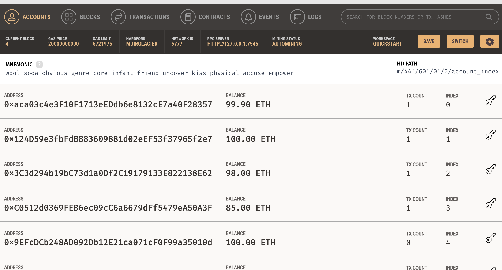

# Crowdsale-ICO


ICO Crowdsales are a novel way for buisnesses to raise capital. This is a demonstration of a blockchain based Crowdsale that accepts Ether in exchange for a token called Kasei Coin. The smart contracts distributes the kaseicoin to the buyers wallet. I have deployed the Solidity Smart Contracts to Remix where I have connected Ganache and Metamask to simulate a complete blockchain development suite. This token Launch inherits some basic characteristics of blockchain including being trustless, permissionless and immutable. This ICO Demo utilizez ERC-20 Standards for Initial Coin Offerings including:

- balanceOf

- ammountRaised

- buyTokens

- claimRefund

- timedCrowdsale

- cappedCrowdsale


## Technologies & Installation

This demonstration utilizes Ganache. Ganache software that mimics a blockchain for development purposes. To install Ganache please see this link:  [Ganache](https://trufflesuite.com/ganache/) and select the installer for your OS. I have also used MetaMask as a Provider for the Ganache private blockchain. Please see this link [MetaMask](https://metamask.io/download/) and select your OS. This will install the MetaMask browser extension. 

What is Ganache?

Ganache is a personal blockchain for rapid Ethereum and Corda distributed application development. You can use Ganache across the entire development cycle; enabling you to develop, deploy, and test your dApps in a safe and deterministic environment. Ganache comes in two flavors: a UI and CLI.

What is MetaMask?

MetaMask is a software cryptocurrency wallet used to interact with the Ethereum blockchain. It allows users to access their Ethereum wallet through a browser extension or mobile app, which can then be used to interact with decentralized applications.

## Usage

This smart contract is written in Solidity and I used the Remix IDE to compile and test functionalities. If the user wants to interact with the smart contract it is possible to clone this repository into a local folder and launch the remix IDE here: [Remix](https://remix.ethereum.org/#optimize=false&runs=200&evmVersion=null&version=soljson-v0.8.7+commit.e28d00a7.js) and select Solidity as the Environment. Next you will want to connect Ganache and Metamask with Remix. 

### Setting up MetaMask

So far you have downloaded the Metamask browser extension from the installations Guide in this README.md. You should be able to select the Metamask icon in the top right corner of your browser window and sign in to your Metamask wallet. Next you will want to connect Metamask with Ganache, to do so, first open Ganache and select the Quickstart option. You should see something like this: 



Copy the ``` RPC SERVER ``` then navigate back to your Metamask wallet and top center of the Metamask window select the Networks tab. Select ``` Add Network ```, and copy the Network Name, New RPC URL and Chain ID from Ganache.


Now that you have set up Metamask to connect to your private blockchain on Ganache you are almost ready. Navigate back to Ganache and while in the Accounts section, you will see 10 distinct valid Ethereum Address's. These represent 10 distinct Accounts that will help to test the Smart Contract Functions. Click on the Key icon and copy & paste the private key for the first Ganache account. Opens Metamask and click on the colored circle in the top right corner, scroll down to ``` Import Account ``` and paste the private key from Ganache into Metamask. This will connect the address's from Ganache to your Metamask wallet. Repeat this for as many Accounts you want to use for the purposes of testing Functions in the Smart Contracts.


The last thing to do is head back to Remix and Compile the 2 files:

``` KaseiCoinCrowdsale.sol ```

``` KaseiCoin.sol ``` 

After the files have been compiled, select the Deploy and Run Icon in the Icon Panel on the left side of Remix window. Navigate to the Environments tab and scroll down to ``` Injected Web3 ``` . Metamask will open and you need to select the Accounts you want to connect. Select the connect to Remix tab.  Now you have sucessfully connected to a local blockchain Ganache with Remix and Metamask. 

It is important to Compile the 2 files ``` KaseiCoinCrowdsale.sol ``` & ``` KaseiCoin.sol ``` Then you want to Deploy them. First you must deploy the ``` KaseiCoinCrowdsaleDeployer ``` In Remix select the Contract Drop Down Tab and select ``` KaseiCoinCrowdsaleDeployer ```, then fill out the input box's next to Deploy tab including the name of Token, Ticker, Origin address and Goal of ICO.


Select Deploy, and Sign the transaction in the MetaMask window. That will launch the Token Address and Contract Address. Next Copy the Contract address and go back to the Contract Drop Down Tab and select the ``` KaseiCoinCrowdsale ``` Contract. Then paste the address you copied earlier into the ``` At Address ``` tab. This will look like this.


# Preview of Smart Contract Funtionality
---


## KaseiCoinCrowdsaleDeployer contract
- Here is the KaseicoinCrowdsaleDeployer contract. You can see this is where I name the coin, give it a Ticker, Supply the Originating Address and set the amount of Coins that the Crowdsale will try to sell. This contract is what deploys the Crowdsale contract.


## KaseiCoinCrowdsale
- Here is the KaseiCoinCrowdsale contract. You can see the KaseiCoinCrowdsale contract getting deployed. Also you can see the functions that come with this contract. Note that the KaseiCoinCrowdsale contract has now been deployed and participants may now interact with the contract and purchase tokens.


## KaseiCoinCrowdsale Contract Features
- Here is the KaseiCoinCrowdsale contract features.
- Functions include: buyTokens, balanceOf, goal, rate, token, wallet, weiRaised. These functions were inherited from the OpenZepplin Crowdsale file that we imported at the top of the KaseiCoinCrowdsale.sol file. They are standard crowdsale functions.


## Account 1 Purchase Tokens
- Here you can see participants interacting with the crowdsale and purchasing tokens. The purchase is verified on the Ganache local blockchain as well as Metemask.


## claimRefund Features
- Here you can see the claimRefund Feature has been included in the KaseicoinCrowdsale Contract. The CappedCrowdsale and TimedCrowdsale functions were also included. I was able to inherit this function by importing the OpenZepplin files:
- CappedCrowdsale.sol
- TimedCrowdsale.sol
- RefundPostDeliveryCrowdsale.sol


## Contributors

stephenthomas43@gmail.com

[Trilogy Education Services](https://www.trilogyed.com/)

[UC Berkeley Extension ](https://extension.berkeley.edu/)


## License 

MIT
